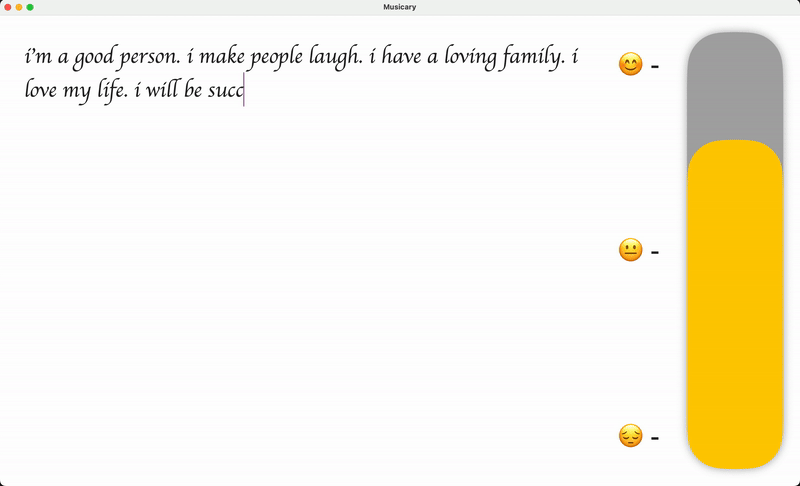

# Musicary

## Demo

[Click to watch the Musicary Demo Video](https://www.youtube.com/watch?v=e_o7vvYgJo4)

The app contains an intelligent audio engine that generates piano notes based on the mood of the user detected from the user’s text as they type. It then gradually guides the user to feel a sense of comfort through the music. Musicary aims to bridge the gap between emotional expression and music, offering users a personalized soundtrack to their feelings, promoting mindfulness and emotional well-being.

## Features

- **Mood Detection**: The app uses a model to detect the mood of the user based on their text input.
- **Music Generation**: It generates a personalized piano soundtrack based on the detected mood.
- **Smile Detection**: Utilizes a vision model to detect whether the user is smiling, providing an additional layer of mood analysis.
- **Progressive Comfort**: The music evolves gradually to create a sense of comfort and well-being.
- **User-Friendly Interface**: A simple and intuitive interface for easy journaling.

Copyright 2023-2024 Musicary - Shravan Prasanth. All rights reserved.
